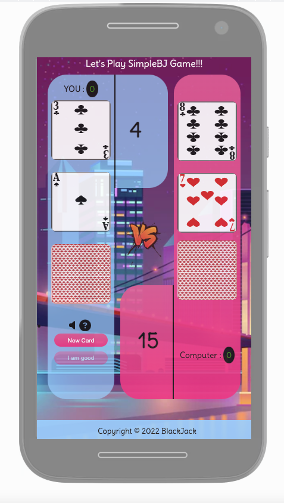

# Purpose of this project

This project was developed in order to demonstrate 
some ability to code in Javascript, CSS and HTML.

# Black Jack

This website have the unique purpose to present a very simple version of the famous game called BlackJack.
The user will play against the computer and the project is called SimpleBJ.

* [Check this out!](https://artontray.github.io/PROJECT2/)

# Contents

* [**User Experience UX**](<#user-experience-ux>)
    * [Wireframes](<#wireframes>)
    * [Site Structure](<#site-structure>)
    * [Programming Structure](<#programming-structure>)
    * [Design Choices](<#design-choices>)
    *   [Typography](<#typography>)
    *   [Color Scheme](<#colour-scheme>)
    *   [User stories](<#user-stories>)
* [**Features**](<#features>)
    * [**Header**](<#header>)
    * [**Body**](<#body>)
    * [**Footer**](<#footer>)
    * [**Error 404**](<#error-404>)
    * [**Future Features**](<#future-features>)
* [**Technologies Used**](<#technologies-used>)
* [**Testing**](<#testing>)
     * Am i responsive?
     * HTML / CSS Validator
     * Browser Compatibility
     * Lighthouse
     * Bugs
* [**Deployment**](<#deployment>)
* [**Credits**](<#credits>)
    * [**Content**](<#content>)
    * [**Media**](<#media>)
    * [**Best part of this project**](<#best-part-of-this-project>)
*  [**Acknowledgements**](<#acknowledgements>)

# User Experience (UX)

## Wireframes

The wireframes for this website were produced with [Balsamiq](https://balsamiq.com/).
The final site varies slightly from the wireframes due to developments that occured 
during the creation process. 

This is the final layout of the Game:

[Back to top](<#contents>)

## Site Structure

SimpleBJ Game website has ONE main page. The [home page](https://artontray.github.io/PROJECT2/index.html) is the default loading page. When first loading, a box Oppens. This Box allows the user to get to know about the objectives and rules of the Game :

After closing the Rules Box, the user can start playing!

 The Game display is divided into 3 parts:
* Card's Player Area : left side
* Card's Computer Area : right side
* Result of the Game Area : in the middle

[Back to top](<#contents>)

## Programming Structure

Before starting coding, I wanted to have a big picture of the programming structure :
 * Beginning of the Game :
 * 2 cards are revealed to both players, two options :
 * - Player 1 have more points than Player 2 :
 *          - Player 1 can continue with only 2 cards ("i-am-good" Click event)
 *                  - Function AddCard() for player 2 is called
 *                  - Function CheckResult() is called
 *                  - Function ShowResult() is called
 *                  - Function incrementScore('The winner') is called
 *          - Player 1 ask for a new card ("new-card" Click event)
 *                  - Function AddCard() for player 1 is called 
 *                  - Function CheckResult() is called
 *                  - If Player 1 have more points (and <= 21) than Player 2, Player 2 needs a new card
 *                          - Function AddCard() for player 2 is called
 *                          - Function CheckResult() is called
 *                          - Function ShowResult() is called
 *                          - Function incrementScore('The winner') is called
 * - Player 1 have less points than Player 2 :
 *          - Player 1 can only ask for a new card ("i-am-good" Click event is disabled)
 *              - Function AddCard() for player 1 is called 
 *              - Function CheckResult() is called
 *                  - If Player 1 have more points (and <= 21) than Player 2, Player 2 needs a new card
 *                          - Function AddCard() for player 2 is called
 *                          - Function CheckResult() is called
 *                          - Function ShowResult() is called
 *                          - Function incrementScore('The winner') is called

 I also used [Excalidraw](https://excalidraw.com/) to build up the main rules of the game before coding :

 

[Back to top](<#contents>)

## Design Choices

 * ### Typography
      The font chosen were 'Delius' for all the content of the website. I have chosen
      to import the font directly from the .ttf file to avoid any problem of compatibility
      in the future.
      

 * ### Colour Scheme
      The colour scheme chosen is blue, pink and purple.
      I got inspired by this following picture : 
	
	
	I decided to use this picture as a body background.

[Back to top](<#contents>)

* ### User stories

First Time Visitor Goals

- As a First Time Visitor, I want immediately to understand the main purpose of the site.
- I want to be able to quickly understand the game controls and mechanics in order to enjoy playing the game
- I want to be able to consult the game instructions as many time I want.
- I want to be able to see my score as I play the game.
- I would like to play a simple game, with a fairly short play time.

Considering that there is no possibility to login for the user, all users are considered as "first time visitor".

[Back to top](<#contents>)

# Features 

The website should have fun colors and is intended for users as an entertainment value.
* ## Body

   ### Middle Page
The middle page is divided in 3 div :

**the Player area :**

* 3 displayed cards

* 2 buttons used for the game

* 1 Sound Button On/Off

* A score area 

* 1 button "How to Play" instructions

**A score Area And Result of the current Game :**

* Score of Player for the current Game
* Score of Computer for the current Game
* Shown Result of the current Game with an Image (Win, Loose or Draw)

**the Computer area :**

* 3 displayed cards

* A score area 

[Back to top](<#contents>)

* ## Header

  ### Title of the Game
This area is dedicated to show the title of the game. Also this area is also used to :
- Show up a Loading Game Message to inform the player that a new game is about to pop up. 
- Show up a Message when user is displaying a page that does not exist: Error 404.html file

* ## Footer

  ### Footer Info
The footer contains informations as copyright and Name of the game

[Back to top](<#contents>)

* ## Error 404

  ### A message is displayed
If the user is displaying a page that does not exist, we display a message and redirect to main page of the Game:

the HTML code for the reloading page is the following:

[Back to top](<#contents>)

  ### Future Features
As a Future Features, I would like to developp a digital currency used in-game to be able to bet an selected amount of this
currency for each game. For that, we will need to save the Player Portfolio and also create a Faucet function in case Player has
no more currency to bet.

[Back to top](<#contents>)

# Technologies Used

* [Javascript](https://developer.mozilla.org/fr/docs/Web/JavaScript) - provides game's functions and rules.
* [HTML5](https://html.spec.whatwg.org/) - provides the content and structure for the website.
* [CSS](https://www.w3.org/Style/CSS/Overview.en.html) - provides the styling.
* [Balsamiq](https://balsamiq.com/wireframes/) - used to create the wireframes.
* [Gitpod](https://www.gitpod.io/#get-started) - used to deploy the website.
* [Github](https://github.com/) - used to host and edit the website.

[Back to top](<#contents>)

# Testing

## Am I responsive Website?
Yes, I am!
- The responsive design tests were carried out on Iphones, Samsung Galaxy S8+, Ipad Air,Surface Pro 7 and even Nest Hub Max with [Google Chrome DevTools](https://developer.chrome.com/docs/devtools/) and also on [Responsive design checker](https://www.responsivedesignchecker.com/).

- Responsive test from https://ui.dev/amiresponsive :

[Back to top](<#contents>)

## HTML / CSS / JSHINT VALIDATOR

### HTML

The HTML validator results is below:
- index.html :

-404.html :

[Back to top](<#contents>)

### CSS
  The website site has been tested through the 
  [CSS Validator](https://jigsaw.w3.org/css-validator/).
  No errors or warnings shows up as the picture below shows :

[Back to top](<#contents>)

### JSHINT Validator
  The website site has been tested through the 
  [JSHINT Validator](https://jshint.com/).
  Some Warnings shows up but only concern ES6 as below :

[Back to top](<#contents>)

## Browser Compatibility

The website was tested on the following browsers with no visible issues for the user :
- Google Chrome
- Mozilla Firefox
- Safari

Appearance, functionality and responsiveness were consistent throughout for a range of device sizes and browsers.

[Back to top](<#contents>)

## Lighthouse
The site was also tested using [Google Lighthouse](https://developers.google.com/web/tools/lighthouse) 
in Chrome Developer Tools to test each pages for:
* Performance - How the page performs while loading.
* Accessibility - Is the site acccessible for all users and how can it be improved.
* Best Practices - Site conforms to industry best practices.
* SEO - Search engine optimisation. Is the site optimised for search engine result rankings.

- Thanks [Panda!](https://tinypng.com/)

After reducing some images, we have the following result of Lighthouse:

[Back to top](<#contents>)

### To sum up
To sum up :

- I confirm that this project is responsive, looks good and functions on all standard screen sizes.
- I confirm that the main content is readable and easy to understand.
- I confirm that the interaction with the user is responsive and efficient.

[Back to top](<#contents>) 

### Bugs

## Fixed Bug

  - The Layout in smaller screen as Iphone SE shows some issues showing the Game buttons.

  
  
  I have been working hard with CSS screen queries to fix it.

  

## Unfixed Bug

It looks like deploying the website on github gives a new Error :
-Error with Permissions-Policy header: Origin trial controlled feature not enabled: 'interest-cohort'.

 

 But after some researching, I found that there is no solution for now:

 [Check this link](https://github.blog/changelog/2021-04-27-github-pages-permissions-policy-interest-cohort-header-added-to-all-pages-sites/)

[Back to top](<#contents>)

# Deployment

### To deploy the project :
The site was deployed to GitHub pages. The steps to deploy a site are as follows:
  1. In the GitHub repository, navigate to the **Settings** tab.
  2. Once in Settings, navigate to the **Pages** tab on the left hand side.
  3. Under **Source**, select the branch to **master**, then click **save**.
  4. Once the master branch has been selected, the page will be automatically refreshed with a detailed ribbon display to indicate the successful deployment.

The live link can be found here - [Here](https://github.com/artontray/PROJECT2)

## How to fork a repository :

If you need to "FORK" a repository:

1. Login in to [GitHub](https://github.com/) and go to https://github.com/artontray/PROJECT2
2. In the top right corner, click `Fork`
3. The next page will be the forked version of https://github.com/artontray/PROJECT2 but in your own repository

[Back to top](<#contents>)

### How to create a local clone of this project :

The method from cloning a project from GitHub is below:

1. Under the repository’s name, click on the **code** tab.
2. In the **Clone with HTTPS** section, click on the clipboard icon to copy the given URL.

3. In your IDE of choice, open **Git Bash**.
4. Change the current working directory to the location where you want the cloned directory to be made.
5. Type **git clone**, and then paste the URL copied from GitHub.
6. Press **enter** and the local clone will be created.

[Back to top](<#contents>)

# Credits 

## Content

* The font came from [Google Fonts](https://fonts.google.com/specimen/Delius?query=delius).
* [Balsamiq](https://balsamiq.com/wireframes/) was used to create the wireframes.
* [VS STUDIO](https://code.visualstudio.com/) was used to edit the code.
* [Chrome Dev Tools](https://developer.chrome.com/docs/devtools/) used for inspecting elements and fix layout issues or JavaScript bugs.
* [Excalidraw](https://excalidraw.com/) to draw the structure of the game.
* [Readme.so](https://readme.so/) was used to write this readme File.

[Back to top](<#contents>)

## Media

* Some Pictures came from [Google Images](https://images.google.com/).
* Some Icons came from [Font Awesome](https://fontawesome.com/).
* Background Image [Free pik Images](https://fr.freepik.com/vecteurs-libre/fond-ville-nuit-dans-neons_3824034.htm#query=fond%20jeu&position=3&from_view=keyword).
* Win Sound are coming from [Youtube](https://www.youtube.com/watch?v=EMYOiK_iQeY).
* Loose Sound are coming from [Youtube](https://www.youtube.com/watch?v=xZzdTK9_EXI).

[Back to top](<#contents>)

## Best part of this project

To be honest, best parts of my learning progress are the following :
- Learning Javascript 
- Learning how to access the DOM
- This function is my favorite one :

[Back to top](<#contents>)

# Acknowledgements
The site was completed as a Portfolio 2 Project for the Full Stack Software Developer Diploma at the [Code Institute](https://codeinstitute.net/).
As such I would like to thank the web in general for beeing such an open library for learning, the Slack community for the good vibes and my mentor **Precious_Mentor** for the support.

This material has been prepared for educational purposes only.

Damien B.

[Back to top](<#contents>)

